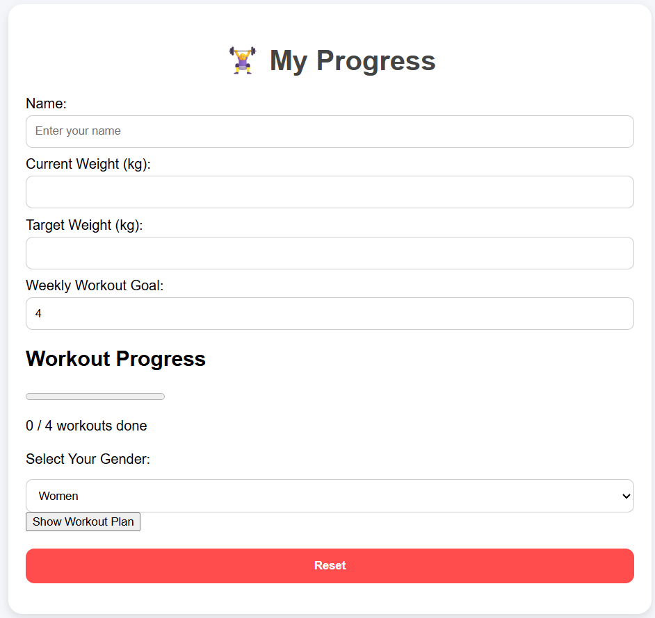

🏋️‍♀️ My Progress – Fitness Tracker App
A responsive web app that helps users track and customize their workouts.
Includes gender-based workout plans, exercise tutorials, and motivational content.

🔧 Tech Used
HTML

CSS

JavaScript

🚀 Live Demo
👉 View Project

## 🚀 Live Demo  
👉 [View Project](https://mechrgui.github.io/fitness-tracker)

## 📸 Screenshot  

📌 Key Features
Separate workout plans for women and men

YouTube video tutorials embedded

Clear section for goals: weight loss vs muscle gain

Clean, mobile-friendly design

